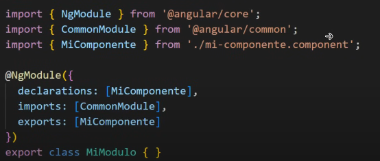

# Módulos
Es un elemento de las arquitecturas de software para agrupar, organizar y encapsular elementos tales como:
- Componentes
- Directivas
- Pipes (filtros)
- Servicios
- Entre otros

Los módulos ayudan para dividir la aplicaciones en partes más pequeñas para hacerlas más manejables y más mantenibles.

## ¿Cómo crearlo?
`ng generate module <nombre del módulo>`

o

`ng g m <nombre del módulo>`

# Estructura:

## Propiedades:
### Declaraciones 
Contiene los artefactos de funcionamiento común como: componentes, directiva y pipes que no estén en modo stand-alone
### Importaciones
Contiene otros módulos que son necesarios para los componentes declarados en este módulo, porque si se quiere usar alguna funcionalidad que exista en otro módulo, tenemos que importarla por acá.
### Proveedores
Contiene los servicios que se encuentran de forma global en la aplicación a traves de un injector llamado module injector.
### Bootstrap
Define los componentes que se inicializarán en la aplicación.